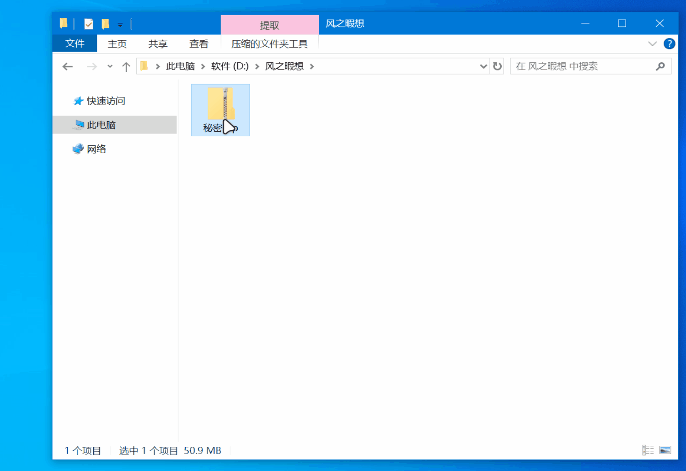

# FileImgSwap

<p align='center'>
<a href=README.md>中文</a> | <a href=README_EN.md>EN</a>
</p>
[**FileImgSwap**](https://github.com/fzxx/FileImgSwap) **文图变**是一款可以把文件与 PNG 图像进行互转的工具，支持加密、图种（附加压缩包）功能，可将任意文件隐藏在 PNG 图像中，也能从生成的 PNG 图像中还原出原始文件。



## 特点

- **文件转 PNG**：将任意类型的文件（如文本、文档、压缩包等）转换为 PNG 图像，文件数据被编码到图像的像素中
- **PNG 还原文件**：从通过本工具生成的 PNG 图像中提取并还原出原始文件
- **加密保护**：通过**同目录同主程序名**的密码/密钥文件进行加密保护
- **图种功能**：可附加压缩包到生成的 PNG 图像尾部，实现"图种"效果
- **元数据**：图片中保留原始文件的名称、修改时间

## 技术细节

- 加密算法：AES-CTR
- 密钥算法：使用PBKDF2-SHA256 和 HKDF-SHA256 密钥派生
- 图像格式：PNG

## 使用指南

将文件/文件夹拖放至程序图标上，或通过命令行运行
#### 文件转 PNG

将普通文件转换为 PNG 图像：
```bash
# 转换单个文件
FileImgSwap file.pdf

# 转换多个文件
FileImgSwap image.jpg data.zip notes.txt
```

转换后会生成 `.fis.png` 后缀的图像文件，例如 `document.pdf` 会生成 `document.fis.png`

#### 还原文件

从 PNG 图像中还原原始文件：
```bash
# 还原单个PNG
FileImgSwap file.fis.png

# 还原多个PNG
FileImgSwap file1.fis.png file2.tz.png
```

还原后的文件会使用原始文件名，如果有同名文件会自动重命名（添加序号）

#### 加密功能

如需加密转换，**在程序同目录下创建**以下文件之一（也可以两个都存在）
- 密码文件：与程序同名的 `.fisp.txt`（如 `FileImgSwap.fisp.txt`），第一行为密码
- 密钥文件：与程序同名的 `.fisp.key`（如 `FileImgSwap.fisp.key`），存放二进制密钥

程序会自动检测并使用这些文件进行加密/解密，**未检测到则不加密**。

#### 图种功能

使用 `-append` 参数将压缩包（zip/rar）附加到生成的 PNG 尾部，**不支持分离**，需要用压缩软件解压
```bash
FileImgSwap video.mp4 -append archive.zip
```

生成的文件会以 `.tz.png` 为后缀，既可以作为普通图像查看，也可作为压缩包解压（建议使用zip/rar格式，解压时改后缀用WinRAR解压）

## 更新日志

[更新日志](CHANGELOG.md)

## 注意事项

- 加密的文件必须使用**相同的密码/密钥文件**才能还原
- 文图变+图种压缩包 可以用不同的密码加密，达成**一图双解**
- 32位程序最大支持2G单文件，64位程序最高支持5GB单文件

## 相关项目

[想曰 - 文本加密让你想曰就曰](https://github.com/fzxx/XiangYue)

[坏坏包 - 让压缩包像坏了](https://github.com/fzxx/NaughtyDamagePack)

## 下载地址

https://github.com/fzxx/FileImgSwap/releases